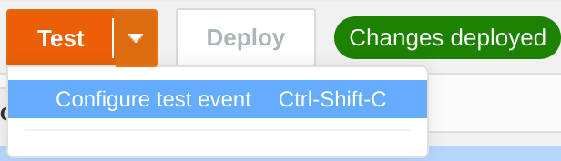

# Part 1: Setting up our DynamoDB Tables and Lambda Functions

In this section we'll go ahead and setup the DynamoDB tables which will serve as our data sources as well as our Lambda functions which will allow us to query the DynamoDB tables and use the results in our Connect Flows.

## DynamoDB Tables
We'll start off with our DynamoDB Tables. 


1. Open the DynamoDB Console by selecting it from the <b>Database</b> section of the AWS Menu.


2. Click on the <b>Create Table</b> button (below screenshot assumes your working with a brand new AWS Account. If not, select <b>Create Table</b> from the menu on the Left hand Side)


3. Our first table will be responsible for storing some basic configuration settings our our Amazon Connect Instance so we'll call this table <b>connectSettings</b>. We'll also define <b>InstanceARN</b> of type <b>String</b> as the partition key. Once we've done this we can go ahead and click on <b>Create</b>.


4. AWS wil take a moment to create this table


5. While that's happening we'll need to create two more tables so go ahead and click on <b>Create table</b> from the menu on the left hand menu.


6. This table will be responsible for storing basic records on each of our customers so we'll go ahead and give it a really creative name like <b>customerRecords</b> and set the Partition key to <b>customerNumber</b>. Once we've done that we can go ahead and click on <b>Create</b> again.


7. We have one more table that we need to create so go ahead and click on <b>Create table</b> a third and final time.


8. This table is going to hold the account details for each of our customers so we'll call this table <b>customerAccounts</b> and give it a partition key of <b>customerNumber</b>. Because this table is likely to have multiple accounts per customer, we'll also give this one a sort key of <b>accountNumber</b>.


9. Once all of that is done and dusted, we should have three DynamoDB tables as shown below. Go ahead and click on <b>customerAccounts</b> so we can add some dummy data to the table.


10. Under the <b>Items</b> tab, go ahead and click on the <b>Create item</b> button.


11. In the create item window, click on the drop-down and select <b>Text</b>. This will allow us to insert JSON into the window.


12. Copy the below JSON contents into the window and click <b>Create</b>.
```json
{
  "customerNumber": 12345678,
  "customerPin": 1234,
  "firstName": "Jack",
  "lastName": "Smith",
  "phoneNumber": "+61412345678",
  "customerType": "Personal",
  "DOB": "240484"
}
```
13. You should now be able to see the new record created in the table.


14. Repeat steps 9-13 for the <b>customerAccounts</b> table using the below data

```json
{
  "customerNumber": 12345678,
  "accountNumber": 9876,
  "AccountBalance": "$123.45"
}
```

15. And for the moment, that's all we need to do on the DynamoDB front. We will need to add some data to the <b>connectSettings</b> table, but we'll need to do a couple of other things first before we have all the information we'll need so for the moment, we'll leave it blank.

## Lambda Functions
Next we can move onto the Lambda Functions that we'll be using. Currently we will need three lambda functions:
* A function to check if we are currently wanting to present a <b>Hot Message</b> to our callers and if so what that message is
* A function that can lookup some customer details from the <b>customerRecords</b> table and return the details to Amazon Connect.
* A function that can lookup a customers accounts and return the account balance from the <b>customerAccounts</b> table.

### Hot Message Check
1. Well start off by building the lambda function that will provide the current state of our <b>Hot Message</b>. To do this we first need to open the Lambda Management Console which we can do by click on <b>Lambda</b> within the <b>Compute</b> section of the AWS menu.


2. Next we want to click on <b>Functions</b> form the menu located on the left hand panel of the console.


3. Then we can click on <b>Create function</b> from the top panel (located on the far right of the screen).


4. Here we need to provide some basic details about the Lambda function. We'll call it <b>connectHotMessageCheck</b> as shown below, and we'll select the <b>Python 3.8</b> runtime. Once we've done that we can go ahead and click on the <b>Create function</b> button.


5. Next we'll need to give it permission to query the DynamoDB table we created earlier <b>connectSettings</b>. The quickest way to do this is to browse through the <b>Configuration</b> settings of the lambda function.


6. Next we need to select <b>Permissions</b> from the left hand menu.


7. Then, we can click on <b>edit</b> button for the <b>Execution Role</b>.


8. and click on <b>View the connectHotMessageCheck-role-xxxx-role</b> link. Your naming might be slightly different than the one in the below image.


9. Once in IAM, we can click on the <b>Attach policies</b> button.


10. And we want to select <b>AmazonDynamoDBReadOnlyAccess</b> from the list. You can search for <b>dynamodb</b> in the filter window to make finding it easier. Once selected, go ahead and click on <b>Attach policy</b>.


11. Back on our lambda screeen, we want to go back to the code section by clicking on <b>Code</b> on the top menu.


12. Go ahead and copy the below code and paste it into the <b>lambda_function.py</b> file.

```python
import json
import boto3

dynamoDBTableName = 'connectSettings'
dynamodb = boto3.resource('dynamodb')

def lambda_handler(event, context):

  instanceArn = event ['Details']['ContactData']['InstanceARN']

  dynamoDBTableName = dynamodb.Table(dynamoDBTableName)
  response = table.get_item(Key={'InstanceArn' : instanceArn})

  #If record exists write values to variables
  if 'Item' in response:
    enabled = response['Item']['enabled']
    hotMessage = response['Item']['hotMessage']

    return {'message': 'Success',
            'enabled' : enabled,
            'hotMessage' : hotMessage
    }

  else:
      return { 'message': 'Fail'}
```
13. once you've got teh code in the lambda function, go ahead and click on <b>deploy</b> to save a copy to the cloud.


14. Next click the down arrow next to <b>Test</b> and click on <b>Configure test event</b>.


15. In the Configure test event window, we want to select <b>Amazon Connect Contact Flow</b> from the available list of templates. Like when we se the IAM policy, we can use the filter to make finding our selection easier.


16. Once we've selected the correct event template we want to copy the <b>InstanceARN</b> value (excluding the quotes) and go ahead and <b>Create</b> the test.


17. We can now create a dummy record for our <b>connectSettings</b> DynamoDB table. To do that, follow steps 9-13 in the previous section and insert the below JSON (make sure to substitute the InstanceARN value for the one you copied from your test event).
```JSON
{
  "enabled": "true",
  "hotMessage": "We are currently experiencing higher than normal call volume",
  "InstanceARN": "arn:aws:connect:ap-southeast-2:123456789012:instance/xxxxxx"
}
```

18. Once you've done that, you should be able to click on <b>Test</b>


19. Under <b>Execution results</b> you should be able to see the output of the lambda query.


### Customer Lookup Lambda Function.

With the <b>connectHotMessageCheck</b> Lambda function out of the way, we now need to deploy the two remaining functions. Starting off with the <b>customerLookUp</b> function, we can follow the steps above we used for the <b>connectHotMessageCheck</b> function, but swap out the following values:
1. for the function name, instead of <b>connectHotMessageCheck</b> we use <b>customerLookUp</b>.
2. instead of the code outlined in step 12, we use the below

```python
import json
import boto3

dynamoDBTableName = 'customerRecords'
dynamodb = boto3.resource('dynamodb')

def lambda_handler(event, context):

  customerNumber = event ['Details']['ContactData']['customerNumber']

  dynamoDBTableName = dynamodb.Table(dynamoDBTableName)
  response = table.get_item(Key={'customerNumber' : customerNumber})

  #If record exists write values to variables
  if 'Item' in response:
    DOB = response['Item']['DOB']
    customerPin = response['Item']['customerPin']
    customerType = response['Item']['customerType']
    firstName = response['Item']['firstName']
    lastName = response['Item']['lastName']
    phoneNumber = response['Item']['phoneNumber']

    return {'message': 'Success',
            'DOB' : DOB,
            'customerPin' : customerPin,
            'customerType' : customerType,
            'firstName' : firstName,
            'lastName' : lastName,
            'phoneNumber' : phoneNumber
    }

  else:
      return { 'message': 'Fail'}
```
3. we can skip creating the dummy records as we've already done that in the previous section.
4. TODO:

### Account Details Lookup Lambda Function.

With two out of three functions complete we can focus on the last function <b>accountLookup</b>. Just like we did for the <b>customerLookUp</b> function, we can follow the steps we used for the <b>connectHotMessageCheck</b> function, but swap out the following values:
1. for the function name, instead of <b>connectHotMessageCheck</b> we use <b>accountLookup</b>.
2. instead of the code outlined in step 12, we use the below

```python
import json
import boto3

dynamoDBTableName = 'customerAccounts'
dynamodb = boto3.resource('dynamodb')

def lambda_handler(event, context):

  customerNumber = event ['Details']['ContactData']['customerAccounts']

  dynamoDBTableName = dynamodb.Table(dynamoDBTableName)
  response = table.get_item(Key={'customerNumber' : customerNumber})

  #If record exists write values to variables
  if 'Item' in response:
    AccountNumber = response['Item']['AccountNumber']
    accountBalance = response['Item']['accountBalance']

    return {'message': 'Success',
            'AccountNumber' : AccountNumber,
            'accountBalance' : accountBalance
    }

  else:
      return { 'message': 'Fail'}
```

3. we can again skip creating the dummy records as we've already done that in the previous section.
4. TODO:

## Conclusion
And that's it for this part, we've created and placeholders for the data we are going to leverage and put in place some lambda functions that will interface with it for us. In a production environment we'd want to tweak the Lambda Functions and point to our actual production datasets, but none of this would materially change the way we implement Amazon Connect. 

It's time to move onto the next part where we [Configure Amazon Lex Bot](Part2.md).