# Configure Amazon Lex Bot

We have our Lambda functions, now we need an Amazon Lex Bot to provide an interaction mechanism with our callers.

## Deploying our First Lex Bot
1. Like all AWS (well most anyway) we need to start off my opening the <b>Lex</b> Management console by clicking on <b>Amazon Lex</b> under the <b>Machine Learning</b> section of the AWS menu.
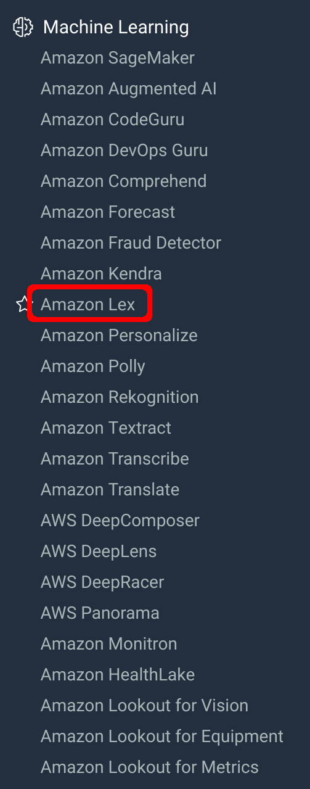

2. Then, we can go ahead and click on <b>Get Started</b>.
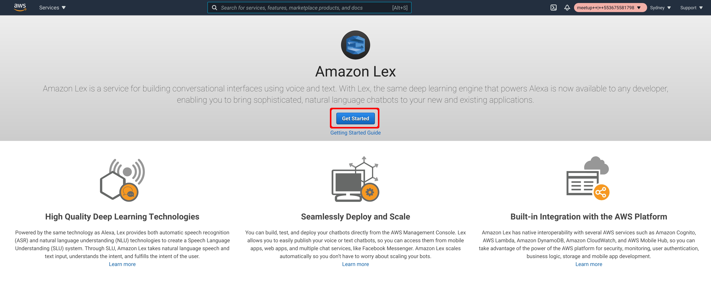

3. Next, click on the <b>Create bot</b> button. Either of them is fine.
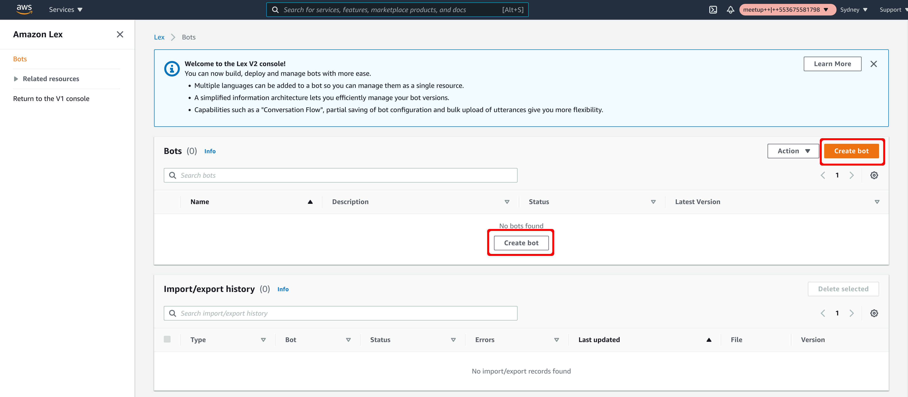

4. Give your new bot a name of <b>purposeOfCallBot</b>, and a description to match.
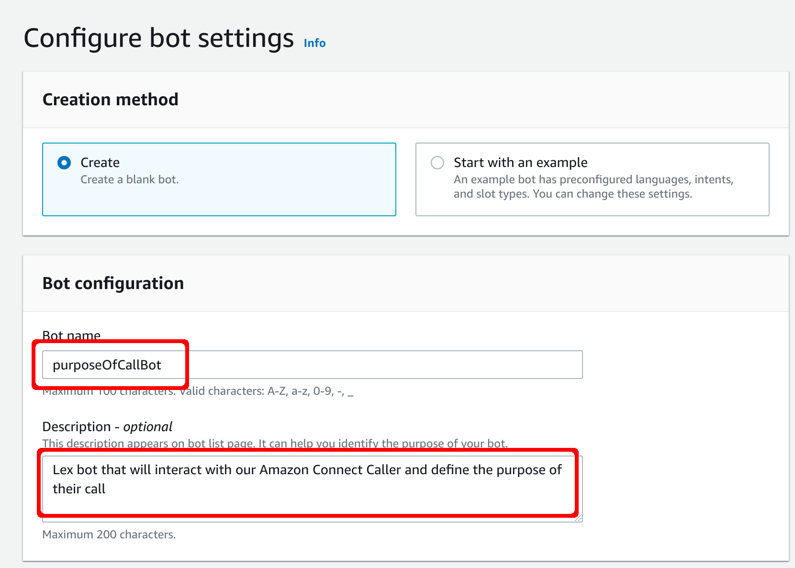

5. Scrolling down the page, we next need to define the <b>IAM permissions</b>. For our workshop example, selecting <b>Create a role with basic Amazon Lex permissions</b> is fine.
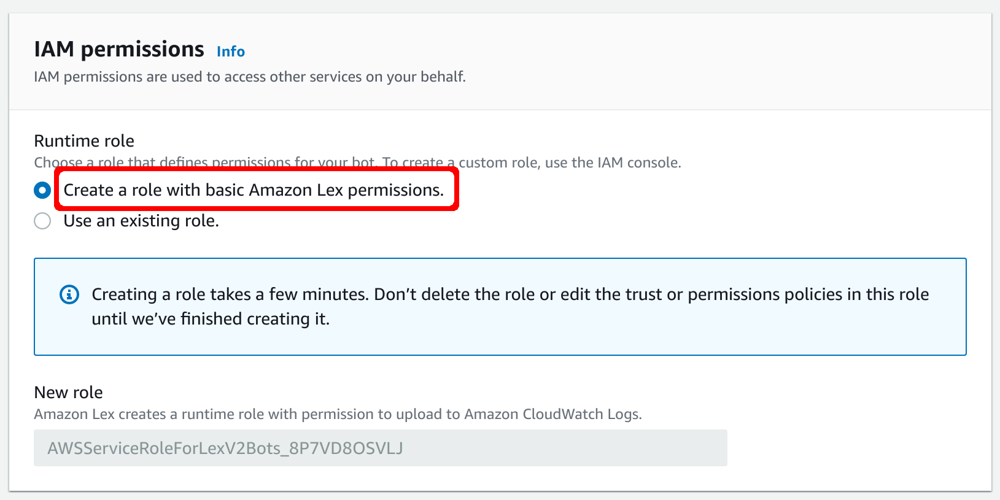

6. A little further down the page and we need to define if we are subject to COPPA. Seeing as we are building a banking solution, we can say no to this question.
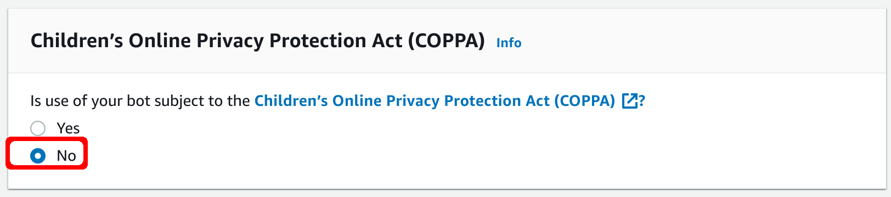

7. The rest of the settings we can leave as define and click <b>Next</b> at the bottom of the page
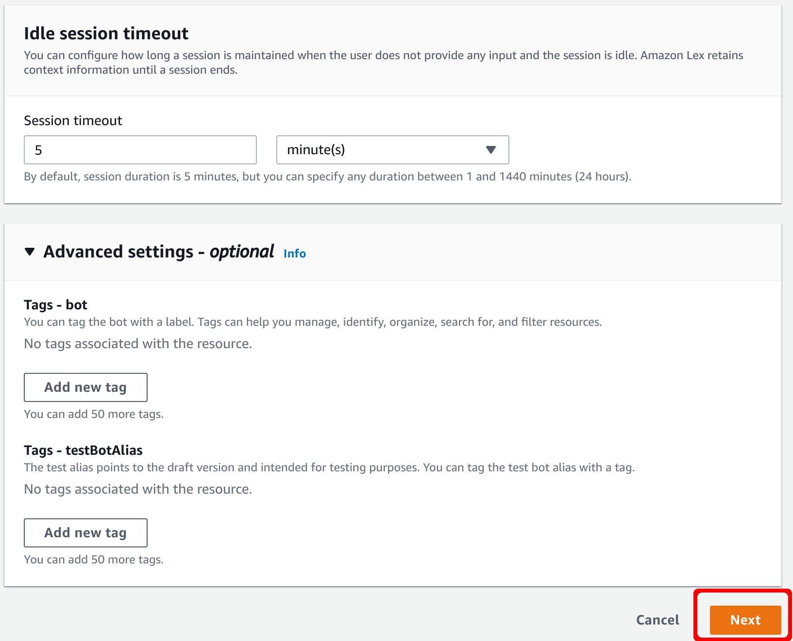

8. For our Example we are only going to support <b>English (US)</b> and the default confidence score is fine, so we can just go ahead and click <b>Done</b>.
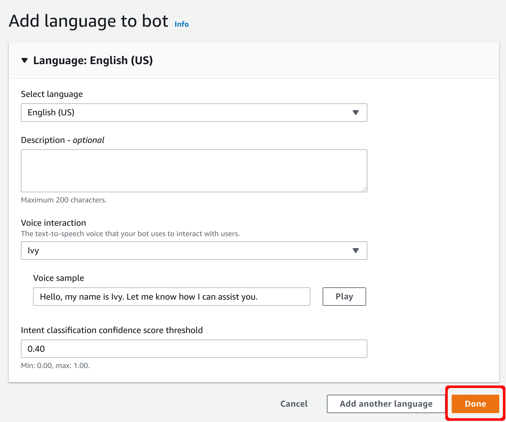

9. After a Moment we will be presented with a <b>NewIntent</b> window. Here we are doing to define an intent that will capture those people wanting to talk to our bank about their Credit Card.. so lets call our Intent <b>CreditCard</b>. Give it a description to match.
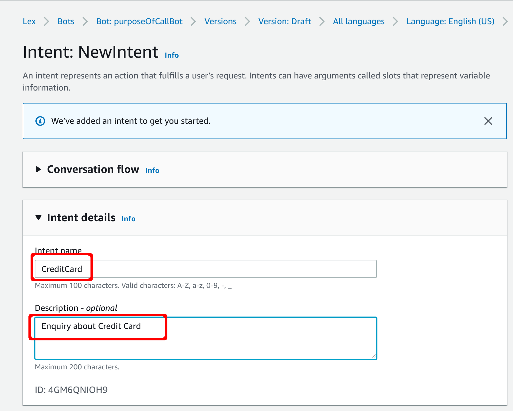

10. Once we've filled in the name and description, we can go ahead and click <b>Save intent</b> located on the bottom panel of the page.

11. Scrolling down the Intent page, we can see the <b>Sample utterances</b> section where we can put in representative phrases that our users might say when they want to trigger this intent. Add several sample utterances, making sure to click <b>Add utterance</b> after each one.
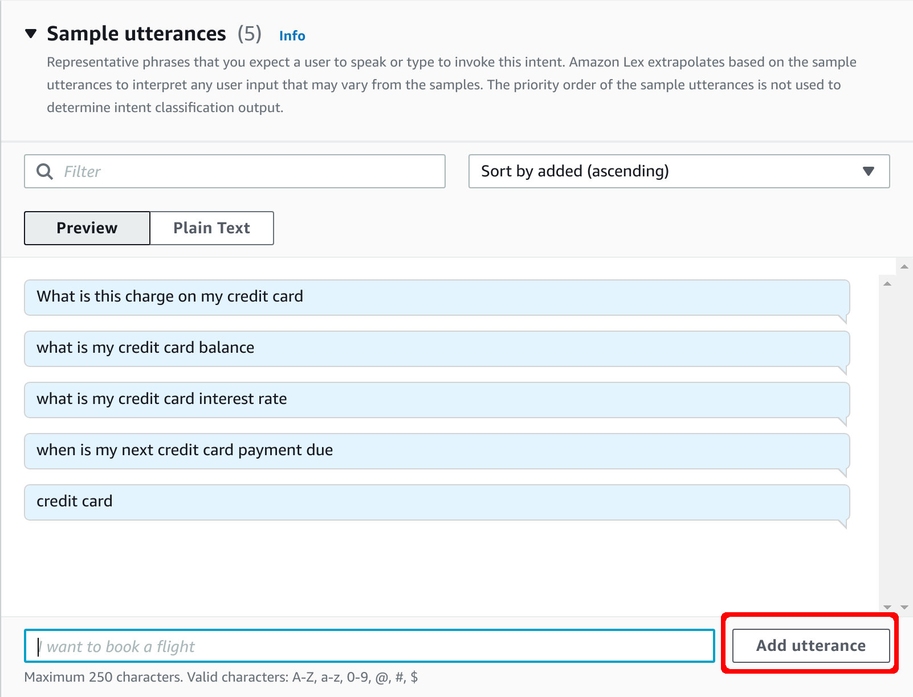

12. Once you've added a few utterances (you can always go back and add more later if you find it's not capturing everything you want it to) click on the <b>Save intent</b> button located on the bottom panel.

13. Only having one option isn't much of a menu so we'll need a few more intents. Click on the <b>Back to intents list</b> so we can add some more.
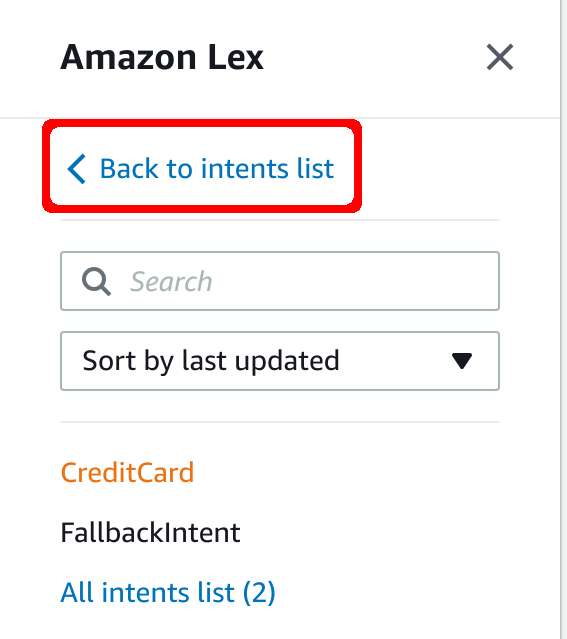

14. Back on the intents page, go ahead and click on <b>Add intent</b>.
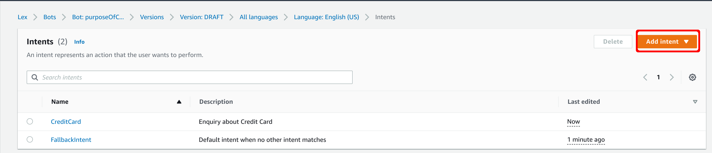

15. Select <b>Add empty intent</b> from the dropdown list.

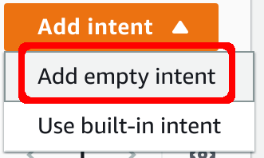

16. Here we are going to define a <b>General</b> Intent that will catch all the general and non-specific enquiries our callers have. Click <b>Add</b> once you've finished entering the name.
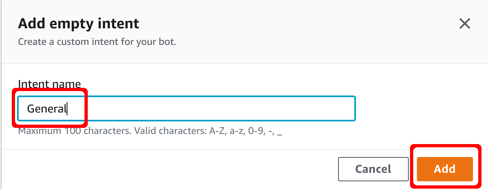

17. Scrolling down the Intent page, we can add our <b>Sample utterances</b> section again. Add several sample utterances, making sure to click <b>Add utterance</b> after each one.
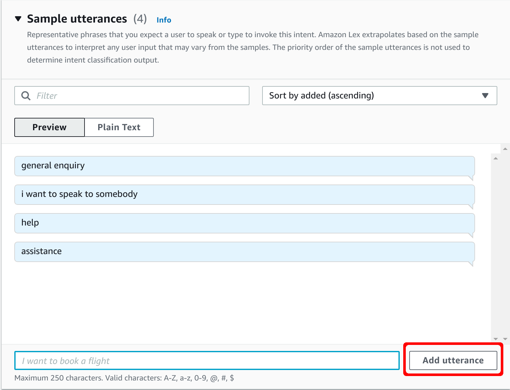

18. Once you've added a few utterances (you can always go back and add more later if you find it's not capturing everything you want it to) click on the <b>Save intent</b> button located on the bottom panel.

19. Will need one more Intent for the moment, so go ahead and click on <b>Back to intents list</b> again.
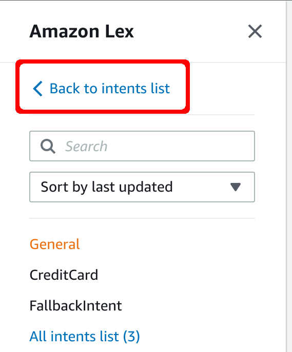

20. Click on <b>Addd intent</b> again, and select the <b>Add empty intent</b> option from the dropdown.
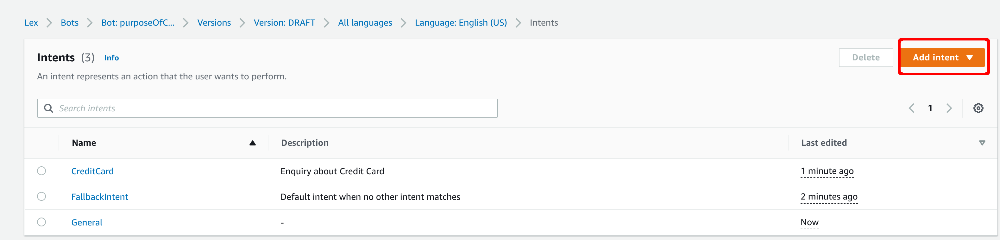

21. Our third Intent will be to capture those people wanting to discuss their Home Loan, so go ahead and give it the name <b>HomeLoan</b> and click <b>Add</b>.
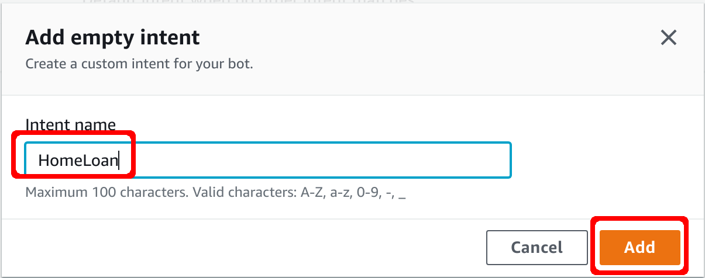

22. Like the previous two, we need to add some <b>Sample utterances</b> to our Intent. Add several sample utterances, making sure to click <b>Add utterance</b> after each one.
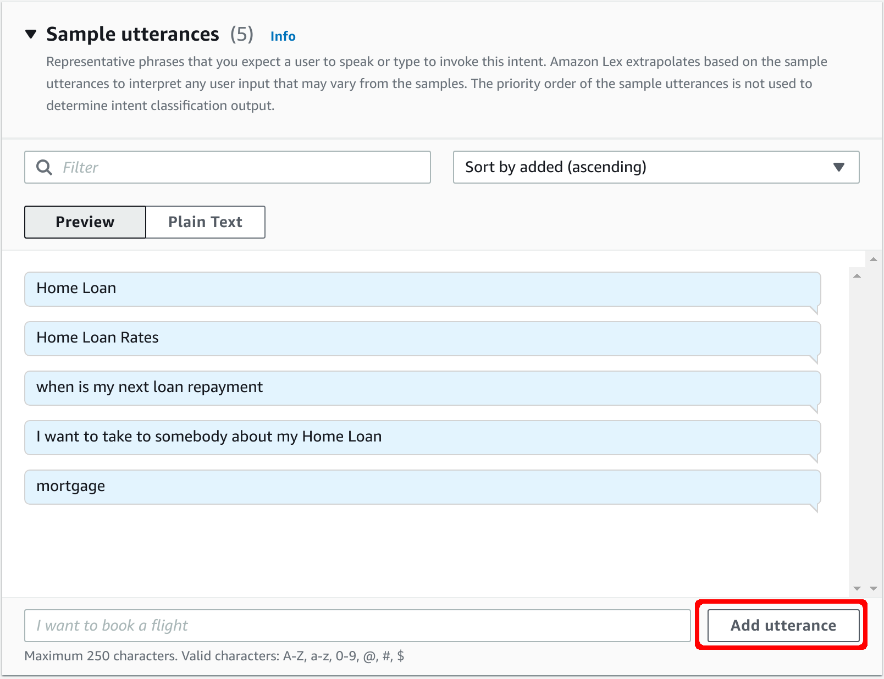

23. Once you've added a few (you can always go back and add more later if you find it's not capturing everything you want it to) click on the <b>Save intent</b> button located on the bottom panel.

24. Now that we've finished configuring our Lex bot it's time to build it. Click the <b>Build</b> button located on the bottom panel.

25. Building the Bot will take a couple of minutes and will show the build status during this time. This is another one of those opportunities to go grab a drink or have a stretch.
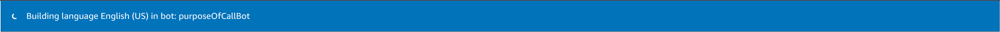

26. After a few minutes you should get a <b>Successfully built</b> message appear.

## Conclusion
We now have a Lex bot that will serve as a menu we can use in our Contact Flows. Next, it's time to [Deploy an Amazon Connect Instance](Part3.md)