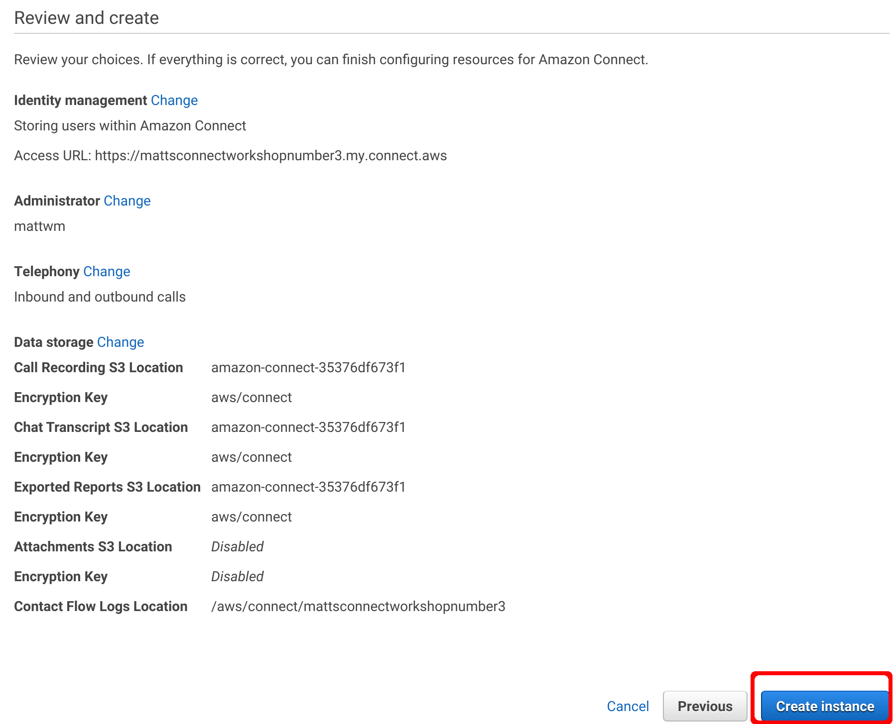

# Deploy an Amazon Connect Instance
It's now time to provision our Amazon Connect Instance and link up our other AWS components so that we can consume them in our Contact Flow's.

## Provision an Amazon Connect Instance
1. Firstly, lets open the Amazon Connect Management Console by selecting <b>Amazon Connect</b> from the <b>Business Applications</b> section of the AWS Menu.


2. Next, we want to go ahead and click the <b>Get started</b> buttton.


3. Because this is a workshop, we can keep the soluition simple and store our user details within our Amazon Connect Instance. This means we just need to provide a globally unique namespace for our access url and click <b>Next step</b>.


4. We need to provide user details for an Admin user. This will be the user who can edit the configuration of our Amazon Connect Instance. Provide your details and email address and click on <b>Next step</b>.


5. Next we need to define if we want our instance to support incoming and outbound calls. For our example we'll want to be using both, so make sure both options are selected and click <b>Next step</b>.


6. Amazon Connect can generate large amounts of data including call recordings, reports, transcripts and other flow logs. For our needs, we can simply go ahead and leave all of these bucket settings as the defaults and click <b>Next step</b>.


7. Finally, we need to review our choices, maaking sure everything is the way we want it, and assuming it is we can go ahead and click <b>Create instance</b>.


8. AWS will them provision our new Amazon Connect Instance. This process normally takes around 5 minutes so sit back and wait for the page to refresh.


9. After about 5 minutes or so we should see a <b>Success</b> message appear. Now you might think you want to click on Get started, but you'd be wrong as there are some other settings we need to define first. Instead, we want  to click on the <b>Amazon Connect AWS console</b> hyperlink at the bottom of the screen.


10. Now, we want to click on our Instance Alias name, which in this example is <b>mattsconnectworkshopnumber3</b>. Note you want to click on the Alias and NOT the Access URL.


11. Here we see the overview of our Connect Instance. We want to configure which Lex and Lambda components are avilable within this instance and to do so we need to click on <b>Contact flows</b>.


## Enabling the use of our Lex Bot
12. The second heading on the <b>Contact flows</b> page is for <b>Amazon Lex</b>. Here we want to click the dropbown next to <b>Bot</b>.


13. Next, we can select the name of the Bot we want to make available to our Connect Instance, which in this case is the <b>purposeOfCallBot</b>.


14. And finally, we need to confirm which Alias we wish to use. Because we didn't change the default in the last part of the workshop, we can just leave <b>Alias</b> as it's default and then click <b>+ Add Lex Bot</b>.


15. If all worked correctly, you should now see your Lex bot appear in the list at the bottom.


## Enabling the use of our Lambda Functions
12. Scrolling further down the page we come to the <b>AWS Lambda</b> section where we can see a dropdown box listing all of the Lambda functions available within our AWS account. Go ahead and select <b>connectHotMessageCheck</b> from the list.


13. Once, we've selected the Lambda function, we need to click the <b>+ Add Lambda Function</b> hyperlink.


14. Repeat this process for the other two lambda functions we've created so that all three are listed like the screenshot below.


## Updating our DynamoDB data
15. We now have our Lambda functions available within our Amazon Connect Instance. However, in order for our <b>connectHotMessageCheck</b> Lambda function to work correctly, we need to add an entry in our <b>connectSettings</b> DynamoDB table with our Instances ARN. We can find our ARN, but on the "Overview" page. Copy the ARN to the clipboard so we can use it in the next step.


16. Back in our [DynamoDB managment console](https://console.aws.amazon.com/dynamodb/) click on the <b>connectSettings</b> table in the list.


17. Next we want to browse to the items in our table, by clicking on the <b>Items</b> tab.


18. Click on <b>Create item</b>


19. We we did in the previous section, we want to change the format to <b>text</b> and enter the following JSON, making sure to replace the InstanceARN value with the one you copied in step 15. 
```JSON
{
  "enabled": "true",
  "hotMessage": "We are currently experiencing higher than normal call volume",
  "InstanceARN": "arn:aws:connect:ap-southeast-2:553675581798:instance/2e392c49-5dc0-4e5a-b1ba-02bc09ceb927"
}
```

20. Once you've got the JSON payload writen, you can click <b>Save</b> to write it to the DynamoDB table.


## Conclusion
And that's it, we now have an Amazon Connect Instance deployed and configured to allow the use of our Lambda Functions and Lex Bot. Now we can go ahead and [Configure our First Contact Flow](Part4.md).