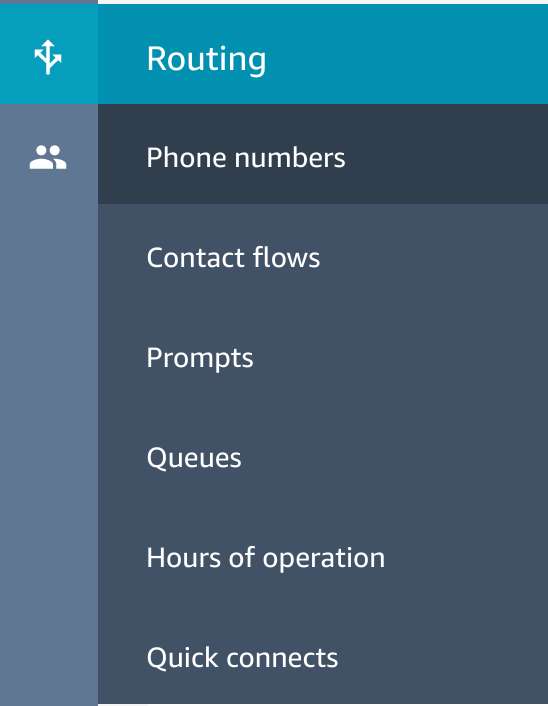

# Configure our First Contact Flow

## Configure our First Contact Flow

1. Firstly, we now need to browse into our Connect Instance. We can find the URL for this by browsing back to the <b>Overview</b> page of our Instance Configuration. Click the <b>Login URL</b> to continue.

2. Once you've logged in we need to create our first Contact Flow (which will actualy be the second one in our actual flow but we'll ignore that for the moment). Select <b>Contact flows</b> from the <b>Routing</b> Menu.

3. Next we need to click on <b>Create contact flow</b> on the right hand side

4. We firstly need to give our Contact flow a name, so we'll call it <b>Menu</b>.

5. now we need to bring in a menu for our customers where we will ask if they are after internet banking or wish to speak to a banking representitive. To do this we need to <b>get customer input</b>. Drag one from the <b>Interact</b> section onto the canvas.

6. Clicking on <b>get customer input</b> and we can define the <b>Text-to-speech or chat text</b> we want. Go ahead and add some prompts asking the caller to press 1 or 2.

7. scrolling down the page and we want to click the <b>Add another condition</b> link twice, so we can add 1 and 2 as options. Click <b>Save</b> once your done.

8. Next, we'll add the second menu for those who press two. This is where we'll use the Lex Bot we configured earlier. Start off by dragging another <b>get customer input</b> block onto the canvas.

9. Like before, when we open up the properties we first need to define some <b>Text-to-speech</b> for the prompt to say. This time we are asking the caller what their call is regarding.

10. Here we need to select that we wish to use an <b>Amazon Lex</b> Bot and then the Bot name and the Alias. Select the <b>purposeOfCallBot</b> from the drop down menu and then the <b>TestBotAlias</b> Alias (or whatever you've got your Alias set to)

11. Next we need to click on <b>Add another intent</b> three times so we can add each of the Lex intents to the list of possible outcomes. Add in <b>CreditCard</b>, <b>General</b> and <b>HomeLoan</b> and click <b>Save once your done.

12. To act as placeholders, we now need to add some <b>Play Prompts</b> so that Connect can tell us which prompt we've gotten to. Drag three <b>Play Prompt</b> steps onto the canvas and connect them to the three possible outcomes (we'll address Default and Error in a moment).

13. For the first prompt (the one linked to the CreditCard Intent) we set some default text and click <b>Save</b>

14. For the Second prompt (the one linked to the General Intent) we tweak the text slightly and click <b>Save</b>

15. For the last prompt (the one linked to the HomeLoaad Intent) we make reference to the Home Loan Team and click <b>Save</b>

16. So that we can test our Contact Flow, we need to close out all of the un-routed possible solutions. To start with, Drag a <b>Disconnect</b> Step onto the canvas and wire it up to the <b>Okay</b> outputs from the previous three <b>Play prompt</b> Steps.

17. Next we wire up the <b>Timeout</b> and <b>Default</b> option from our initial <b>get customer input</b> step to also point to our Lex Bot. This will ensure that all customer enquiries are at least handled, even if not in the most effectent way possible. We can come back to this at a later stage and improve the handling.

18. Next we need to handle when a caller try to select <b>Option 1</b> (phone banking). So we can test our contact flow, for the moment we can just add a prompt and then route the call to the <b>General Banking</b> team. We will come back and add another <b>Contact Flow</b> to handling Phone Banking in the next Part of the workshop. For the moment, add a <b>Play Prompt</b> Step to the canvas and link it to other steps as shown below.

19. For the prompt, we just add some placeholder text saying phone banking is currently unavilable. click <b>Save</b> once your done.

20. Next we link the <b>Default</b> output from our Lex bot to the <b>General Banking Prompt to again make sure all customer enquiries are caught.

21. Lastly, we add one final prompt to capture any error scenarios, and just like the other's we route that to the General Team as well.

22. For the prompt we just add some boiler plate text and click <b>Save</b> when where done.

23. With all that done, we can go ahead and <b>Save</b> our flow.

24. and click <b>Save</b> to the <b>Save Flow</b> prompt.

25. Next, we can go ahead and click <b>Publish</b> which will make it available to the rest of our instance.

26. and click <b>Publish</b> to the popup.

## Configure Dial In

1. First we want to broowse to the phone number section.

2. Click <b>Claim a number</b>

3. select a country, phone number and the <b>Menu</b> Contact Flow and click <b>Save</b>.

4. You should now be able to ring the inbound number and navigate the menu structure. In the next section we will add [Phone Banking](Part5.md)